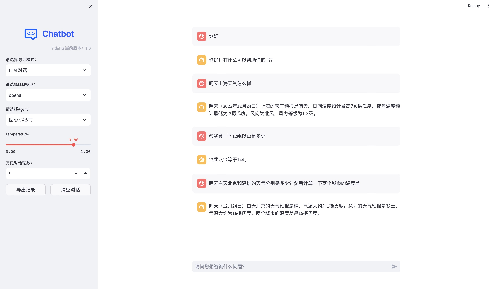

# 基于LLM的聊天机器人与自主智能体
基于LLM的聊天机器人，AI Agent的自主智能体，利用Function、Tools、Agent来实现LLM自主工作。
该项目旨在利用最先进的语言模型创建一个对话式AI，并通过各种功能和工具使智能体能够自主运行。同时探索LLM在复杂任务型对话（Tod）上的应用。

`项目还在开发中，欢迎大家提出建议和意见。`

## 概述
该仓库包含了部署和与基于LLM的聊天机器人及其自主智能体交互所需的代码库和资源。它采用了自然语言处理中的前沿技术，实现了意义深刻且引人入胜的对话交流。

## 特点
- LLM聊天机器人： 利用大型语言模型生成类人响应，在多样化话题上进行对话。

- 自主智能体： 通过功能、工具和自主框架使聊天机器人能够自主运行。
- 可定制化： 通过修改配置和训练数据，轻松适应特定领域或用例。
- 任务型对话： 通过对话式AI实现复杂任务型对话（Tod）。

## 演示



## 入门指南
要设置环境并与聊天机器人和智能体交互，请按照以下步骤操作：

克隆仓库：

```
git clone https://github.com/YidaHu/chatbot.git
cd chatbot
```

安装：

```bash
# 示例指令以安装依赖项
pip install -r requirements.txt
```
使用：

```bash
sh run.sh
```

## 贡献
我们欢迎社区贡献以改进此项目。

## 许可证
本项目基于 MIT 许可证。

## 致谢
我们向使这个项目成为可能的开源社区和贡献者表示感谢。
WebUI界面参考了[Chatchat](https://github.com/chatchat-space/Langchain-Chatchat)项目。

## 联系
如有任何疑问或反馈，请随时通过 huyidada@gmail.com 联系我们。